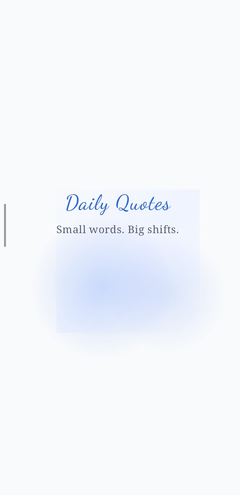
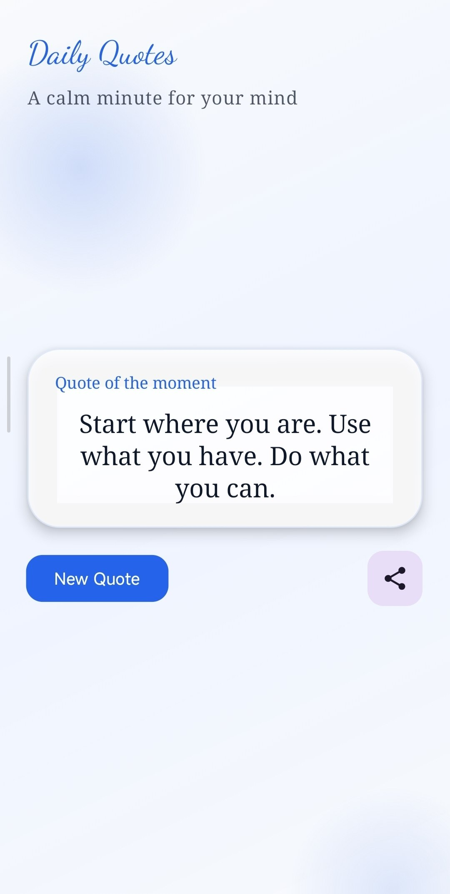
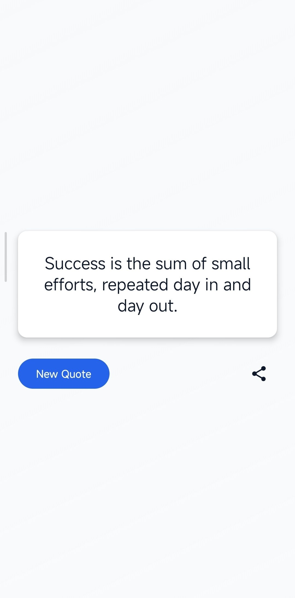

# Daily Quotes

A clean, modern Android app built with Kotlin and Jetpack Compose. It includes a minimalist splash screen and a refined home screen with a glassy quote card, subtle motion, and native sharing.

## Highlights
- 2-screen flow: splash -> home
- Material 3 UI with a light, modern aesthetic
- Crossfade transitions between quotes
- Subtle motion cue on the main action button
- Native Android share intent

## Screens
### Splash
- Centered logo with gentle fade and scale-in
- Automatic navigation after 2 seconds

### Home
- Modern layout with a centered quote card
- Glassy surface, soft border, and subtle gradient background
- New quote action and share shortcut

## Screenshots




## Design System
- Primary color: #2563eb
- Background color: #f8fafc
- Theme: clean, minimalist, responsive
- Motion: light, smooth, and unobtrusive

## Architecture
- Simple MVVM-style separation
- UI state managed by a `QuotesViewModel`
- Navigation handled by Navigation Compose

## Project Structure
```
app/
	src/main/java/com/sagendy/dailyquotes/
		MainActivity.kt
		ui/theme/
			Color.kt
			Theme.kt
			Type.kt
```

## Tech Stack
- Kotlin
- Jetpack Compose (Material 3)
- Navigation Compose
- AndroidX Lifecycle ViewModel

## Requirements
- Android Studio Hedgehog or newer (or compatible tooling)
- Android SDK with API 36 installed
- JDK 11

## Setup
1. Clone or download the repository.
2. Open the project in Android Studio.
3. Allow Gradle to sync and download dependencies.

## Build
```bash
./gradlew assembleDebug
```

## Release APK
```bash
./gradlew assembleRelease
```

Output location:
- app/build/outputs/apk/release/
- release/app-release-unsigned.apk

Note: Release builds are unsigned unless you add a signing configuration. For a distributable APK, configure a keystore in the `release` build type.

## Run
Option 1: Android Studio
- Select a device or emulator
- Click Run

Option 2: CLI
```bash
./gradlew installDebug
```

## GitHub Release (Manual)
1. Build the release APK using the command above.
2. Create a new GitHub Release from the repository page.
3. Upload the APK from `app/build/outputs/apk/release/`.

## Testing
```bash
./gradlew test
```

## Customization
- Quotes: edit the list in `QuotesViewModel` in `MainActivity.kt`.
- Colors: update `Color.kt` and `Theme.kt`.
- Typography: adjust styles in `Type.kt` and in the composables.
- Background: tweak the `AppBackground` composable for gradients and shapes.

## Troubleshooting
- If you see SDK XML version warnings, update Android command-line tools and ensure a single SDK path is configured.
- If builds fail due to missing SDKs, install API 36 and build-tools via the SDK Manager.

## License
No license specified.
